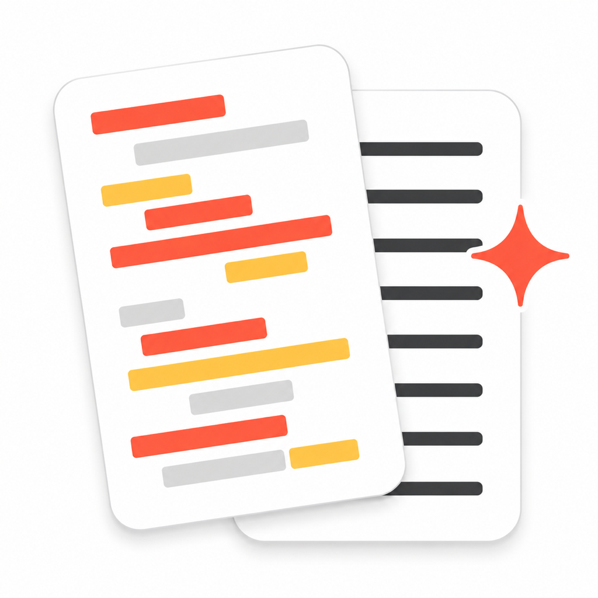

<p align="center">
  
</p>

<h1 align="center">PasteClean</h1>

<p align="center">
  <strong>Compose once, paste perfectly into Gmail.</strong><br/>
  An iOS app that sanitizes rich text so your formatting survives Gmail's rendering pipeline.
</p>

<p align="center">
  <a href="https://apps.apple.com/us/app/pasteclean/id6769190276">App Store</a> &bull;
  <a href="PRIVACY_POLICY.md">Privacy Policy</a>
</p>

---

## The Problem

You write a beautifully formatted email in dark mode — bold headings, bullet lists, blockquotes. You paste it into Gmail. Gmail repaints everything on a white background. Your white-on-dark text becomes white-on-white. Invisible.

## The Fix

PasteClean sits between your writing and Gmail:

1. **Write** your email in the built-in rich text editor
2. **Preview** how it'll look in Gmail (light + dark mode)
3. **Copy** — PasteClean sanitizes the HTML and places Gmail-safe markup on your clipboard
4. **Paste** into Gmail's compose window — formatting intact

## What Gets Sanitized

| Issue | What PasteClean Does |
|-------|---------------------|
| Dark mode colors (white text) | Fixes contrast to black for light backgrounds |
| Inline styles Gmail strips | Removes unsupported CSS properties |
| Unsafe elements (`<script>`, `<style>`) | Strips completely |
| Unknown elements (`<article>`, `<section>`) | Unwraps to keep children |
| Non-Gmail fonts | Normalizes to Gmail-safe font stacks |
| Broken flex layouts | Converts `display:flex` to `display:block` |
| Blockquotes | Styled to match Gmail's native left-border quote |
| Images | Adds `display:block` to fix descender gaps |

## Architecture

```
packages/
  mobile/          React Native (Expo SDK 54) iOS app
  gmail-sanitizer/ HTML sanitization pipeline (cheerio-based)
```

The sanitizer runs entirely on-device. No server, no network requests, no data collection.

### Native Clipboard Module

PasteClean includes a custom native module (`HtmlClipboardModule.swift`) that writes HTML to the iOS clipboard as a `com.apple.webarchive` — the same format Safari uses. This bypasses `expo-clipboard`'s `NSAttributedString` round-trip, which strips inline styles and breaks Gmail paste formatting.

## Development

```bash
# Install dependencies
pnpm install

# Run on iOS simulator
cd packages/mobile
npx expo run:ios

# Run tests
pnpm test          # all packages
cd packages/mobile && npm test   # mobile only

# Run E2E (Maestro)
pnpm e2e
```

## Privacy

PasteClean processes everything locally on your device. No analytics, no tracking, no network requests. See the full [Privacy Policy](PRIVACY_POLICY.md).

## License

MIT
